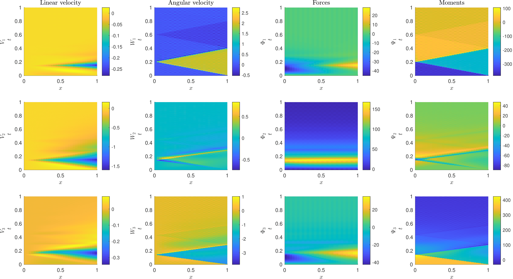

# GEB-Feedback
Simulation of a Geometrically Exact Beam clamped at one end and with a velocity feedback control applied at the other end.
Reference: Control and stabilization of geometrically exact beams, Charlotte Rodriguez, 2022 (PhD Thesis)
https://opus4.kobv.de/opus4-fau/frontdoor/index/index/docId/18049

The main file is: SIMU_GEB_V2_2.m
Other .m file contain functions of use in the main file.

Some pictures:

* without control:

&nbsp;&nbsp;&nbsp;&nbsp;&nbsp;&nbsp;   

&nbsp;&nbsp;&nbsp;&nbsp;&nbsp;&nbsp; 

* with control: the beam is stabilized to its straight reference configuration

&nbsp;&nbsp;&nbsp;&nbsp;&nbsp;&nbsp;   

&nbsp;&nbsp;&nbsp;&nbsp;&nbsp;&nbsp; 
